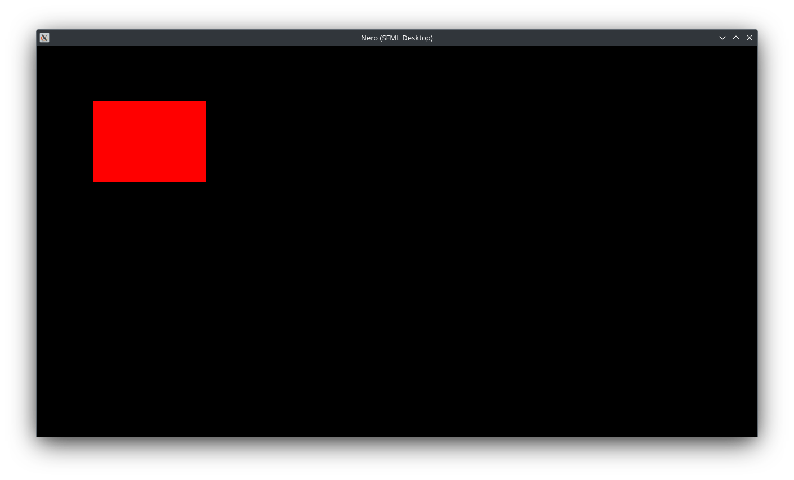

# Nero Engine

A multi‑platform OpenGL engine with 2D/3D rendering, Lua gameplay, SFML desktop host, WebGL runtime, Android support, and experimental PS1/PS2/PSP backends.

---

## 🚀 Current Status

The engine successfully initializes the SFML desktop host and renders its first quad using the 2D renderer.

### Screenshot (May 15, 2026)

---

## 🧩 Modules

- **Core** — engine lifecycle, update loop, render dispatch  
- **Renderer2D** — immediate‑mode quad rendering (in progress)  
- **Renderer3D** — mesh + shader system (scaffolding)  
- **Platform**  
  - SFML desktop host  
  - WebGL host (planned)  
  - Android host (planned)  
  - PS1/PS2/PSP experimental backends  

---

## 🛠 Build Instructions

### Desktop (SFML)

